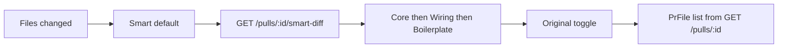

# Spec: Smart Diff (Files changed)

## Goal

On the PR **Files changed** tab, show a Smart view (default) that lists
files in risk order from `GET /pulls/:id/smart-diff`, with finding
badges and inline severity — without calling an LLM or “Run Review”.

## Scope

- In:
  - Smart / Original toggle on Files changed; **Smart is default**.
  - Smart view: render `groups[]` in API order (`core` → `wiring` →
    `boilerplate`). Group labels from existing i18n
    (`prReview.smartDiff.coreLabel` / `wiringLabel` /
    `boilerplateLabel`). Boilerplate **starts collapsed**.
  - File header **N findings** badge: click expands the file and
    scrolls to the first finding line.
  - Inline severity badges + row tint on lines in `finding_lines` /
    `findings[]`.
  - Original view: existing `PrFile[]` from `GET /pulls/:id` (current
    DiffViewer), unordered by role.
  - React Query hook → `GET /pulls/:id/smart-diff` (`SmartDiff` /
    `SmartDiffResponse`). Component tests for toggle, collapse, badge
    scroll.
  - Extend `messages/en/prReview.json` `smartDiff` keys (toggle labels
    if missing); do not hard-code English.
- Out:
  - “What this does” / any `pseudocode_summary` block (field stays
    `null`; do not invent copy).
  - Client-side `classifyFile` (trust the API).
  - Triggering a review run, SSE, or any LLM.
  - Asserting a lockfile / Boilerplate group on seed PR #482 (seed has
    none).

## Acceptance criteria

- [ ] Opening Files changed (`tab=diff`) shows Smart grouping without
      an extra click. Seeded core file `src/middleware/ratelimit.ts`
      and wiring file `src/config.ts` both render; Core group label is
      visible. `src/config.ts` still appears (existing e2e).
- [ ] Original toggle restores the ungrouped DiffViewer file list;
      switching back to Smart restores groups.
- [ ] Empty roles are not rendered (no Boilerplate heading when the
      payload has no boilerplate files).
- [ ] Findings badge on a file with `findings.length > 0` expands that
      file and scrolls to the line. Inline severity + row tint use
      existing severity tokens (CRITICAL / WARNING / SUGGESTION).
- [ ] No “What this does” heading or summary paragraph.
- [ ] Flow `e2e/specs/05-pr-diff.flow.json` stays key-free (no Run
      Review).

## Out of scope

- Implementing `GET /pulls/:id/smart-diff` (server). UI consumes it.
- Changing classifier patterns (`reviewer-core`).
- Split-suggestion UX beyond showing `split_suggestion` if
  `too_big` (optional; not required for the e2e flow).

## Boundaries

**Touch:**

- `client/src/app/repos/[repoId]/pulls/[number]/_components/DiffTab/`
- `client/src/components/diff-viewer/` (`DiffViewer`, `FileCard`,
  `CodeLine` — finding tint / badges)
- `client/src/lib/hooks/` (new `useSmartDiff` or equivalent)
- `client/messages/en/prReview.json` (`smartDiff`)
- Colocated `*.test.tsx`

**Do not touch:**

- Run Review dropdown UX (still invalidate `["smart-diff", prId]` from
  `useRunReview` / delete-run success so badges appear after a review).
- Findings tab accordion (except reusing severity color tokens).
- `@devdigest/shared` SmartDiff shape unless a real contract gap
  appears (already has `groups`, `split_suggestion`, `finding_lines`,
  `findings[]`). Keep the client vendor copy in sync with
  `server/src/vendor/shared` if you must edit it.
- `reviewer-core` classifier.

## Gotchas

- **Do not classify in the browser.** Role and sort come from
  `GET /pulls/:id/smart-diff`. Server composes `pr_files` + latest-wave
  findings (`agent_runs.head_sha === pull.head_sha`). Seeded review
  rows with **null `run_id`** attach **only when no matching wave
  exists** — that is how PR #482 still shows the Stripe-key finding on
  `src/config.ts` without a run.
- `FileCard` today auto-expands when churn ≤ `AUTO_EXPAND_MAX_LINES`
  (200). Smart mode must still **collapse the Boilerplate group** even
  when those files are small.
- `SmartDiffFile.findings` is `{ id, start_line, end_line, severity,
  title }` — not a full Finding card. Don’t fetch `/reviews` just to
  tint lines.
- Existing GitHub inline comments on DiffTab stay available; they are
  independent of Smart grouping.
- Seed PR #482 files include `src/middleware/ratelimit.ts` (core) and
  `src/config.ts` (wiring). There is **no** lockfile in seed — do not
  wait for Boilerplate / `package-lock.json` in e2e.

## API contract (consumed)

`GET /pulls/:id/smart-diff` → `SmartDiff`:

- `groups[]`: `{ role, files[] }`
- `split_suggestion`: `{ too_big, total_lines, proposed_splits }`
- Each file: `path`, `additions`, `deletions`, `finding_lines`,
  `findings[]`, `pseudocode_summary: null`

## UI flow

1. User opens PR #482 → Files changed.
2. Smart is on: Core group (e.g. `src/middleware/ratelimit.ts`), then
   Wiring (`src/config.ts`). No Boilerplate group.
3. User clicks the findings badge on a file → card expands, viewport
   scrolls to the tinted line.
4. User toggles Original → same files, GitHub/import order, no role
   headings.

## Component map

```
DiffTab/
  toggle Smart | Original (Smart default)
  Smart: role groups → FileCard (boilerplate group collapsed)
  Original: DiffViewer(files) as today
lib/hooks → GET /pulls/:id/smart-diff
diff-viewer/FileCard + CodeLine → badge, tint, scroll
```


