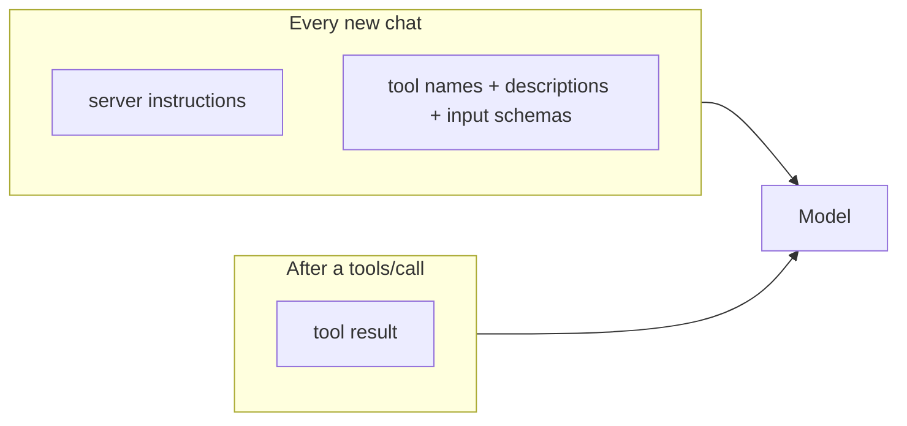

# MCP server best practices

How to build a local MCP server so a **new chat does not spend a large
token budget before the user has said anything**, and so tools stay
correct, discoverable, and safe. Written for DevDigest L04
(`devdigest-mcp`); the practices are general.

This is reference, not a spec. Verify SDK package names and versions at
implementation time — the TypeScript SDK split in 2026 (see
[Sources](#sources)).

## Why new chats get expensive

The host calls `tools/list` and injects **every tool name, description, and
JSON Schema** into the model before the first user message. That tax is
paid even if the chat never calls a tool. Tool *results* then stay in
context for the rest of the conversation.



Three layers, in order of impact:

| Layer | When it is paid | Typical size |
|---|---|---|
| Tool catalog | Every new chat, before the first message | ~200–500 tokens per tool if descriptions/schemas are verbose |
| Server `instructions` | Often copied into the system prompt | Easy to bloat if it restates every tool |
| Tool results | After a call, then on every later turn | Can dwarf the catalog if you dump full JSON |

Documented extremes: a 106-tool MySQL server at ~55k tokens on init; 7+
servers at 67k+ tokens. A **five-tool** server stays cheap if each tool is
short. The failure mode is not “five tools exist”; it is “five tools each
ship a tutorial, nested schemas, and duplicated field docs.”

For a small, well-named catalog, **eager listing of all tools is the
official recommendation**. Progressive discovery (`search_tools` → load
schema → call) is for when definitions take a meaningful slice of the
context window (hosts often switch around 1–10%). Do not invent a
meta-search layer for five tools.

---

## 1. Structure and transport

### 1.1 SDK and canonical shape

Use the official MCP TypeScript SDK. Two lines exist; pick one at
implementation time and stay on it:

| Line | Package | Serve pattern |
|---|---|---|
| v1 (widely deployed) | `@modelcontextprotocol/sdk` | `new McpServer()` → `registerTool(...)` → `connect(transport)` |
| v2 (2026 spec line) | `@modelcontextprotocol/server` | factory → `serveStdio(createServer)` (or HTTP `createMcpHandler`) |

Keep **Zod in `dependencies`**, not `devDependencies` — tool `inputSchema`
runs in production. Let the SDK validate arguments before the handler
runs.

### 1.2 Transport: stdio for local studio use

Cursor / Claude Code spawn a local child process and speak JSON-RPC on
stdin/stdout. **stdio is the right transport** for a same-machine
DevDigest tool: no port, no HTTP session, host owns process lifetime.

Use Streamable HTTP only if the server must be shared by many remote
clients.

### 1.3 Never write to stdout

On stdio, **stdout is the protocol channel**. `console.log` corrupts
JSON-RPC and the host looks “broken.”

Log with `console.error` (stderr) or `server.sendLoggingMessage()`. This
is mandatory, not style.

### 1.4 Register with the host

Project-scoped config so the server is shared with the repo:

- `.mcp.json` at the repo root (commit it), or
- `claude mcp add --transport stdio --scope project`

Hosts snapshot tools at **session start**. Adding or renaming a tool
requires a new chat; mid-session `tools/list_changed` is not something
to rely on for authoring.

---

## 2. Tool definition design (the new-chat tax)

### 2.1 Naming

- `snake_case`, **verb-noun**: `list_agents`, `get_findings`,
  `run_agent_on_pull_request`.
- Names must be unique **within this server**.
- Prefer a domain prefix when several MCP servers are connected:
  `devdigest_list_agents` (or a server name the host already namespaces).
  Prefixes avoid collisions with GitHub / filesystem / other toolboxes.
- `title` is for the UI; `name` is the stable identifier the model calls.

### 2.2 Few tools, not one per HTTP route

Group by job. Five focused tools beat twenty CRUD wrappers. Put bulky
reference data in **Resources** (fetched on demand), not in tool
descriptions. Skip unused `prompts/` and empty resource templates — they
still add handshake surface.

### 2.3 Descriptions are decision aids, not docs

The model needs: when to pick the tool, and what each argument is.

Bad (paid on every chat):

```text
This tool allows you to search for files in the filesystem by providing a
glob pattern. It will return a list of all files that match the pattern.
You can use standard glob syntax including wildcards like * and **.
```

Good:

```text
Search files by glob. Returns matching paths.
```

### 2.4 Zod schemas

Provide a Zod `inputSchema` for every tool. Use `.describe()` on **every
field** — that string is what the model sees, and it also drives runtime
validation and TypeScript types.

- Flatten where a flat parameter list works; nested objects add structural
  tokens.
- Enums over “string, one of json or csv, explained in a paragraph.”
- Defaults in the schema instead of documenting omitted behavior.
- Required only when actually required.
- `z.coerce.number()` (and similar coerce) when clients may send strings
  for numeric fields.
- One short example only for a *complex* tool — Anthropic’s data shows
  examples beat long prose for parameter accuracy.

Do not duplicate long field essays across tools. If several tools take
`repoId` / `prNumber`, keep those descriptions one short line. Protocol
`$ref` dedup is still a proposal; until hosts honor it, write the same
short phrase.

### 2.5 Server `instructions`

A domain blurb, not a second catalog. Describe **when this server is
useful**, cross-tool workflow, and constraints. Do not restate each tool.

With host-side tool search (Claude Code can lazy-load MCP tools when
definitions exceed ~10% of context), `instructions` is what tells the
host *to search this server at all*. Target: 2–4 sentences.

### 2.6 Annotations (four hints)

Set them **explicitly**. SDK defaults assume the worst (`destructive` /
`openWorld`), which produces extra confirmation prompts.

| Hint | Meaning |
|---|---|
| `readOnlyHint` | no writes |
| `destructiveHint` | may delete or overwrite (only meaningful if not read-only) |
| `idempotentHint` | twice = once (only meaningful if not read-only) |
| `openWorldHint` | talks to the open world (LLM, GitHub, network) vs a closed local store |

Annotations are **UX hints, not security**. Clients must treat them as
untrusted unless the server itself is trusted. Do not skip auth because
`readOnlyHint` is true.

Suggested mapping for the five DevDigest tools:

| Tool | Hints |
|---|---|
| `list_agents` | `readOnlyHint: true` |
| `get_findings` | `readOnlyHint: true` |
| `get_conventions` | `readOnlyHint: true` |
| `get_blast_radius` | `readOnlyHint: true` (stub still read-only) |
| `run_agent_on_pull_request` | `readOnlyHint: false`, `destructiveHint: false` (adds a run, does not delete), `openWorldHint: true` (LLM / GitHub) |

Human-in-the-loop belongs on the write tool. Spec: servers MUST validate
inputs, access-control, rate-limit, and sanitize outputs.

A stub (`get_blast_radius` before Blast Radius exists) should say it is
unimplemented and return a short, stable payload — not a fake graph the
model will treat as truth.

---

## 3. Keep results small (the tax after the first call)

The catalog is a one-time hit per chat. Results stay in context.

- **Project, don’t dump.** Return `id`, `name`, `status` — not the whole
  DB row, prompt, or diff.
- **Cap output.** `limit` / cursor / max chars. Pagination already exists
  on `tools/list`; use the same idea for findings.
- **Summaries first.** Counts + top N; a `detail` flag or a second call
  for the rest.
- **Never return secrets, stack traces, or raw diffs unless asked.**
- **Errors:** unknown tool / bad args → protocol error. Business failure
  → result with `isError: true` and a short recoverable message.

Host-side “code mode” (model writes a script; only the summary returns)
is a *client* pattern. A local five-tool server does not need a sandbox;
it needs tight return shapes.

---

## 4. What the host does (you influence this)

Official guidance for Cursor / Claude Code / custom agents:

- **Small catalog** — inject all tools. That is fine for five concise
  tools.
- **Large catalog** — progressive discovery: search → inspect schema →
  call.
- Changing the tool list **mid-chat breaks prompt cache**. Don’t
  add/remove tools per turn; treat disconnect as a conversation boundary.
- Some hosts already lazy-load MCP tools. A concise catalog + a clear
  `instructions` line is what those hosts need.

You cannot usefully implement host-side search inside a five-tool server.
You *can* make the catalog so cheap that hosts never hide it.

---

## 5. Practical budget for five DevDigest tools

| Piece | Target |
|---|---|
| Server `instructions` | ~2–4 sentences: what DevDigest MCP is, when to use it |
| Per-tool description | 1–2 sentences |
| Per-parameter description | a few words via Zod `.describe()` |
| Catalog at chat start | hundreds of tokens, not thousands |
| Default tool result | compact JSON, capped list, no full prompt/diff |

That is the whole new-chat problem at this size: **short names, short
descriptions, flat schemas, no duplicated docs, no unused
prompts/resources, tight returns, stdio + stderr-only logging.**

---

## Sources

- [MCP tools spec](https://modelcontextprotocol.io/specification/2025-03-26/server/tools)
- [MCP client best practices](https://modelcontextprotocol.io/docs/2025-03-26/develop/clients/client-best-practices) (progressive discovery, code mode, prompt cache)
- [TypeScript SDK — first server](https://github.com/modelcontextprotocol/typescript-sdk/blob/main/docs/get-started/first-server.md) and [Server guide](https://ts.sdk.modelcontextprotocol.io/v2/documents/Documents.Server_Guide.html)
- [Tool annotations](https://blog.modelcontextprotocol.io/posts/2026-03-16-tool-annotations/)
- [MCP tool schema bloat](https://layered.dev/mcp-tool-schema-bloat-the-hidden-token-tax-and-how-to-fix-it/)
