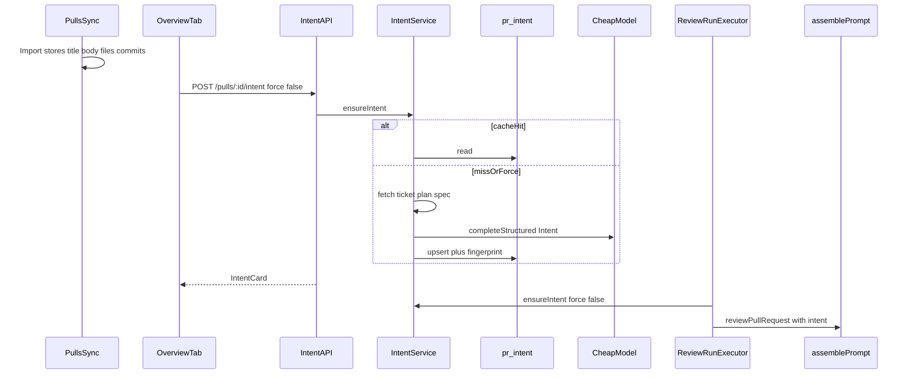

# Intent Layer (L03)

Derive, cache, and display PR intent from title/body/ticket/plan-spec signals;
inject it into review prompts as untrusted context with a fixed out-of-scope
CRITICAL policy. Cheap model via Settings `review_intent` (default
`openrouter` / `deepseek/deepseek-v4-flash`, same as seeded agents).

## End-to-end flow

1. **PR import / detail refresh** — title, body, files, commits in DB; linked
   issue resolved live from body (`#N` / closes) when GitHub is available
   (not persisted).
2. **Open Overview** — client `POST /pulls/:id/intent` with `{ force: false }`
   (lazy ensure; page does not block on LLM).
3. **Ensure pipeline** — gather signals → fingerprint → cache hit or fetch
   linked plan/spec/ticket → cheap structured LLM → confidence clamps →
   upsert `pr_intent`.
4. **Regenerate** — same endpoint with `{ force: true }`.
5. **Run review** — after diff load, `ensureIntent(false)` once (shared
   pre-work); pass `Intent` into every agent; `assemblePrompt` adds untrusted
   intent section + trusted `INTENT_SCOPE_POLICY`.
6. **Findings policy (prompt-enforced)** — real defects keep true severity even
   if out of scope; never demote CRITICAL on low confidence; never invent
   CRITICAL for unmet description promises.



## Context sources

| Source | When | Notes |
|---|---|---|
| PR title | always | |
| PR body | when present | Cap for LLM input |
| Linked ticket | `#N` / closes in body | GitHub Issues API |
| Plan/spec URLs | markdown/bare links matching plan/spec/design/rfc/adr/`docs/` | Required when present; SSRF allowlist |
| Repo-relative `docs/` / `specs/` | same | Read from clone; reject `..` |
| File paths + commit subjects | always as indirect | Cap lists; **never** pass unified diff into intent LLM |

**No description:** `synthesis_mode: inferred_from_signals`, `missing_inputs`
includes `description`, confidence clamped ≤ 0.45.

**Caching:** SHA-256 of `title|body|issueKey|urls|paths|commits`. Hit if
fingerprint matches and `!force`.

## Schema (`pr_intent`)

Keep `intent` / `in_scope` / `out_of_scope`. Add via migration `0013_pr_intent_meta`:

- `confidence`, `synthesis_mode`, `risk_areas`, `sources`, `missing_inputs`
- `input_fingerprint`, `model`, `computed_at`

## Intent Zod

```ts
{
  intent, in_scope, out_of_scope,
  confidence: 0..1,
  synthesis_mode: 'author_stated' | 'ticket_grounded' | 'inferred_from_signals',
  risk_areas: string[],
  sources: { kind, ref, fetched_ok? }[],
  missing_inputs: string[],
}
```

Edit **both** `server/src/vendor/shared` and `client/src/vendor/shared`.

## API

- `GET /pulls/:id/intent` → `PrIntentRecord` or 404
- `POST /pulls/:id/intent` `{ force?: boolean }` →
  `{ pr_id, status: 'cached'|'computed', model, computed_at, intent }`

HTTP fetch allowlist: `github.com`, `raw.githubusercontent.com`,
`gist.githubusercontent.com`; resolve DNS and reject private/link-local IPs;
5s timeout; 64 KiB streamed body cap. Outbound HTTP goes through
`Container.http` (`SafeHttpClient`), not feature-module `fetch`.

## Prompt / review

- `ReviewRunExecutor`: after diff, best-effort `Deriving PR intent`
- `assemblePrompt`: `## Derived PR intent` via `wrapUntrusted` +
  trusted `INTENT_SCOPE_POLICY` when intent present

## UI

Overview `IntentCard`: italic summary, IN/OUT SCOPE, RISK AREAS, confidence
badge, Regenerate. Auto-ensure on mount. Seed intent for PR #482.

## Risks

- Dual/triple shared trees drift if only one of `server`/`client` vendor or `client/src/lib/feature-models.ts` is edited
- SSRF via plan/spec URLs — mitigated by `SafeHttpClient` (allowlist + DNS private-IP check); residual DNS-rebinding TOCTOU remains without IP pinning
- Missing API keys — graceful UI error; reviews still run
- Existing workspace overrides may still point at `gpt-4.1`
