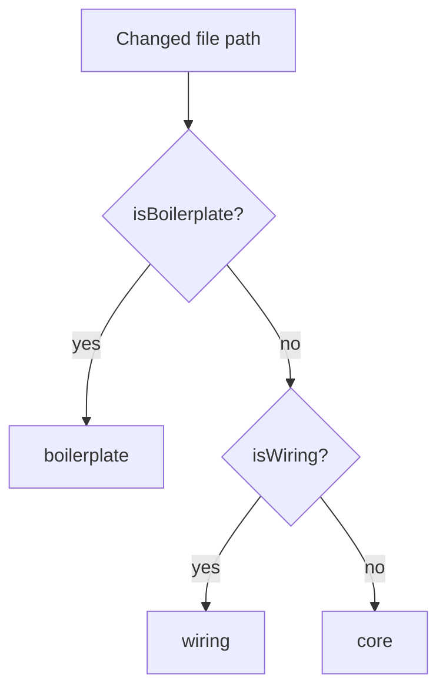

# Spec: Smart Diff (classifier)

## Goal

Deterministically rank and group a PR’s changed files by review risk
(`core` → `wiring` → `boilerplate`) with **no LLM call**, and overlay
latest-wave findings onto those files for the Smart Diff payload.

## Scope

- In:
  - `classifyFile(path)` — path-only role. Patterns live in
    `src/smart-diff/constants.ts` (lockfiles, generated trees, wiring
    basenames / config regexes). Boilerplate wins over wiring.
  - `buildSmartDiff(files, findings)` — groups in `ROLE_ORDER`, omits
    empty roles, sorts files within a group (findings first, then churn
    desc, then path). Always sets `pseudocode_summary: null`.
  - `split_suggestion`: `too_big` when total changed lines ≥
    `TOO_BIG_CHANGED_LINES` (400); `proposed_splits` named from
    `SPLIT_NAME_BY_ROLE` (`Core logic` / `Wiring` / `Boilerplate`).
  - Public exports from `src/index.ts`. Unit tests in
    `test/smart-diff.test.ts`.
- Out:
  - HTTP, DB, GitHub, filesystem.
  - Choosing *which* findings are “latest wave” (server:
    `agent_runs.head_sha === pull.head_sha`; seed reviews with null
    `run_id` only if no matching wave).
  - UI, i18n, “What this does” / pseudocode generation.

## Acceptance criteria

- [ ] `classifyFile('src/middleware/ratelimit.ts')` → `core`;
      `classifyFile('src/config.ts')` → `wiring`; lockfiles /
      `package.json` / `dist/` / `*.snap` / `*.generated.*` →
      `boilerplate` (`test/smart-diff.test.ts`).
- [ ] `buildSmartDiff` returns `{ groups, split_suggestion }` matching
      `SmartDiff` in `@devdigest/shared`. Empty groups are omitted.
- [ ] Each `SmartDiffFile` has `finding_lines` (unique `start_line`s,
      sorted) and `findings[]` of `{ id, start_line, end_line, severity,
      title }` only; `pseudocode_summary` is always `null`.
- [ ] No `LLMProvider` (or any network) is invoked from this package
      path.

## Out of scope

- `GET /pulls/:id/smart-diff` composition (server).
- Files changed Smart/Original UI (client).

## Boundaries

**Touch:**

- `reviewer-core/src/smart-diff/classify.ts`
- `reviewer-core/src/smart-diff/constants.ts`
- `reviewer-core/src/smart-diff/build.ts`
- `reviewer-core/src/index.ts` (re-exports only)
- `reviewer-core/test/smart-diff.test.ts`

**Do not touch:**

- Prompt / grounding / `LLMProvider` pipeline.
- Server routes, seed, or schema.
- Client DiffTab / DiffViewer.

## Gotchas

- Keep every new basename / regex / directory name in `constants.ts` —
  `classify.ts` must not inline patterns.
- Boilerplate is checked first so `dist/index.js` is not wiring.
- Classifier is path-only; churn and findings affect **sort**, not role.
- Seeded demo PR #482 has **no lockfile** — tests that need boilerplate
  must pass an explicit lockfile path, not assume seed data.

## Classify flow

